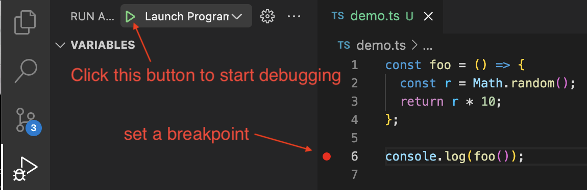

# node-ts-jest-starter
## prerequisites
* Node.js >= 8

## get started
* npm install

## testing
Create test files with suffix `.spec.ts`. Run test with the command below:
```bash
npm test
```

## run a specific .ts file
```bash
npm start <file_name>
```

## debug ts
set breakpoints on the .ts file that you want to debug. Go to debug panel (Shift + CMD + D) and launch program.  

